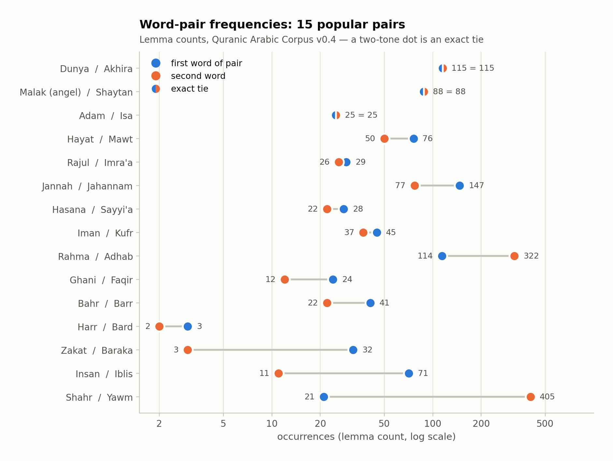
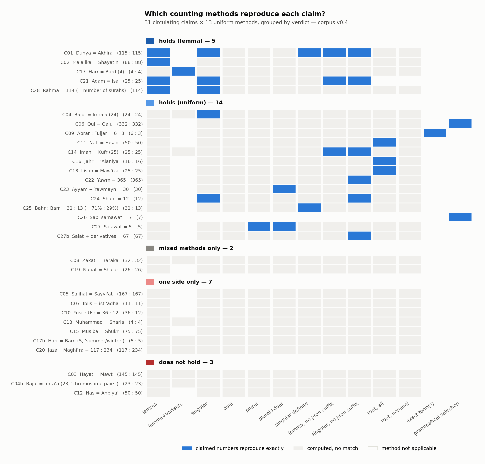

# Quran Word Frequency Counts

**A verified frequency count of 38 selected words in the Quran** (life, death, angel, satan,
this-world, hereafter, …), derived from the Quranic Arabic Corpus morphological annotation,
v0.4 [1]. Every word is counted by several uniform methods side by side — by lemma, by root, by
part of speech, by grammatical number — rather than by a single cherry-picked figure, and every
counted occurrence (7,806 unique locations) is indexed by chapter:verse:word, so any number in
this document can be checked by hand ([§4](#4-validation)). On top of the counts,
[§5](#5-claims-audit) audits 31 popular numerical claims about the Quran — Nawfal's word
pairs, "yawm = 365", "sea : land = 71% : 29%" — each evaluated against every counting method,
with an explicit verdict and the exact selection behind every reproducing number.

*Counts computed and audited 2026-06-11 from corpus morphology v0.4 (frozen snapshot,
committed in `data/`). Earlier published figures from this repository contained errors; the
audit that found and fixed them is documented in [§2](#2-audit-findings-and-corrections).*

---

## 1. Results

Lemma counts — the word in all its grammatical forms (singular, dual, plural, all cases).
Other counting methods are defined in [Methods](#3-methods) and reported for every word in
[`output/full_counts.csv`](output/full_counts.csv).

| Pair | A | B | Worth knowing |
|---|--:|--:|---|
| Dunya / Akhira | **115** | **115** | exact match; Akhira = feminine "hereafter" only (§2.2) |
| Malak / Shaytan | **88** | **88** | exact match; both lemmas include their plurals |
| Adam / Isa | **25** | **25** | exact match |
| Hayat / Mawt | 76 | 50 | with variant nouns: 79 / 56 (§2.4) |
| Rajul / Imra'a | 29 | 26 | with (suppletive) plurals: 57 / 85 |
| Jannah / Jahannam | 147 | 77 | Jannah includes جنات (71 plural) |
| Hasana / Sayyi'a | 28 | 22 | with -āt plurals: 31 / 58 |
| Iman / Kufr | 45 | 37 | Kufr with variant nouns: 41 |
| Rahma / Adhab | 114 | 322 | Rahma = number of surahs |
| Ghani / Faqir | 24 | 12 | exact 2:1 |
| Bahr / Barr | 41 | 22 | Barr = land 12 + righteous/dutiful 10 (§2.3) |
| Harr / Bard | 3 | 2 | with variants: 4 / 4 |
| Zakat / Baraka | 32 | 3 | Baraka with "blessed" (mubārak): 15 |
| Insan / Iblis | 71 | 11 | Insan + ins (collective): 89 |
| Shahr / Yawm | 21 | 405 | singular-only: **12** / **375** |

Standalone words: **Qaala** (said) 1,618 verb occurrences — 1,004 perfect, 265 imperfect, 349
imperative, of which *qul* ("say!", 2nd masculine singular) is 332 — and **Maghfira**
(forgiveness) 28, the 38th word, paired with jazāʾ in the claims audit (C20). Embryology sequence
(lemma + declared variants, §3.3): turab (dust) 17 → nutfa (drop) 12 → alaqa (clot) 6 →
mudgha (lump) 3 → izam (bones) 15 → lahm (flesh) 12.

Two results that nuance popular claims, stated plainly:

- **Yawm (day) singular is 375, not 365.** The lemma total is 405 = 375 singular + 27 plural +
  3 dual; yawma'idhin ("that day", 70×) is a separate lemma and is not part of the 405. The
  circulating 365 reproduces only under a specific convention documented in the claims audit
  (§5, C22).
- **Shahr (month) singular is 12**, which does match the popular claim.



## 2. Audit findings and corrections

A from-scratch audit (2026-06-11) found that earlier published figures from this project
contained errors — including a miscount of the word list itself (38 words, not 37). Each
finding below is shown with full supporting evidence in notebook 03, section 2, and was
confirmed against the corpus website [2].

### 2.1 Izam (bones): 2 → 15

The corpus tags the plural عظام (ʿiẓām, "bones") under the lemma `EaZiym` — the same lemma as
عظيم "great/mighty" — distinguishable only as noun entries with plural marking (`POS:N` + `MP`),
13 occurrences including the embryology verse 23:14 (twice). Counting the bone lemma `EaZom`
alone gives 2 and silently misses all of them. The corpus website keeps the same filing and
glosses those entries "[the bones]" (e.g. 2:259:51, 23:14:10, 75:3:5), so this is an upstream
annotation decision, not a parsing artifact; any bones count must use the selector
`(lemma=EaZiym, POS=N, NUMBER=P)`.

### 2.2 Akhira: masculine remainder is 40, not 30

Lemma `A^xir` totals 155 (not 145 as previously claimed): 115 feminine آخرة "the hereafter"
+ 40 masculine آخِر "last/latter" — two genuinely different words sharing one lemma, separated
by a gender filter. The separate lemma `A^xar` (آخَر "another", 70×) is not involved.

### 2.3 Barr: land 12 + righteous/dutiful 10 (was "13 + 9")

Form-level split of the 22 occurrences of lemma `bar~`: genitive `bar~i` ×12, all in "in the
land" contexts; 52:28 is the divine name *al-Barr*; 19:14 and 19:32 are "dutiful (to parents)";
أبرار ×6 and بررة ×1 are "the righteous". Every row is listed in notebook 03 §2.3.

### 2.4 Hayat/Mawt variant asymmetry

Mawt had been credited the variant nouns `mawotat` (3) + `mamaAt` (3) → 56 while Hayat received
nothing. Its exact counterparts — `m~aHoyaA` (2; 6:162 pairs مَحْيَا with مَمَات in a single
verse) and `HayawaAn` (1; 29:64 "the true life") — are now included symmetrically → 79.

## 3. Methods

### 3.1 Counting unit

The corpus represents each word of the Quran as one or more *segments* (prefix, stem, suffix).
We count **STEM segments only** (77,915 in total): the definite article, attached pronouns, and
case endings are not words. The full annotation format and the Buckwalter transliteration used
throughout are described in the [Appendix](#appendix-corpus-format-and-transliteration).

### 3.2 Linguistic definitions

- **Lemma** (`LEM`) — the dictionary headword. The corpus files regular plurals, duals, and many
  broken plurals under the singular's lemma (e.g. أيام "days" under `yawom`), so a lemma count
  is "the word in all its grammatical forms".
- **Root** (`ROOT`) — the (usually three-consonant) derivational skeleton shared by related
  words (k-t-b → kitāb "book", kātib "writer", maktaba "library"). Proper nouns generally have
  no root in the corpus.
- **Broken / suppletive plurals** — irregular plurals stored under their *own* lemma
  (rajul "man" → rijāl "men"; imraʾa "woman" → nisāʾ "women", a different root entirely). These
  are standard Arabic morphology and are handled as explicit variants, listed per word.
- **PGN** — person-gender-number tags (e.g. `3MS`, `MP`); the trailing S/D/P gives grammatical
  number, with unmarked number read as singular (Arabic leaves singular implicit).

### 3.3 Counting methods

Applied uniformly to every word — no cherry-picking:

| Method | What it counts |
|---|---|
| **Lemma** | Exact lemma match, all grammatical forms |
| **Lemma + variants** | Plus declared variant selectors (irregular plurals / variant nouns under other lemmas) |
| **Singular only** | Lemma match, excluding dual and plural |
| **Root, nominal** | All nouns, adjectives, proper nouns, time adverbs sharing the root |
| **Root, by POS** | Root totals split by noun / adjective / proper noun / verb / time adverb |
| **By number** | Lemma split into singular / dual / plural |

A variant selector is either a plain lemma (`rijaAl` for `rajul`) or a `(lemma, POS, NUMBER)`
triple where only a slice of another lemma belongs to the word — required exactly once, for the
bones plural (§2.1). One gender filter exists (Akhira, §2.2); no other word needs one (verified
against all candidate lemmas).

All methods, plus per-root listings of every derived lemma and the Qaala verb-form breakdown,
are computed in notebook 03 and exported to `output/full_counts.csv`.

### 3.4 Tooling

The annotation file is a documented TSV; it is parsed directly with pandas (`src/parser.py`),
which is standard practice for this dataset. Alternatives were evaluated: JQuranTree [4] (Java;
used here for validation, not counting), QuranTree.jl [5] (Julia), and the `qurancorpus` pip
package [6] (abandoned; reads only the obsolete v0.1 XML format). The parser is verified line
by line against the raw file and by the validation layers below.

Charts are generated by the notebooks through a single shared style module
(`src/plotstyle.py`): one fixed palette (validated for color-vision-deficiency separation and
surface contrast), one title/label treatment, one mark vocabulary across every figure.

## 4. Validation

Three independent layers, strongest last:

1. **Internal.** The parser's STEM count is asserted against an independent scan of the raw
   file (77,915). Sixteen sanity asserts pin the audited values in notebook 03, and notebook 04
   asserts every claims-audit verdict and its key counts; the occurrence index is asserted to
   tie out with the count grid for all 38 words. The unit and integration test suite
   (`tests/`, 54 tests) pins the same invariants for CI-style checking.
2. **Upstream revision.** Every root used by the 38 words (35 roots) and every additional root
   used by the claims audit (22 roots) was compared against the corpus maintainers' dictionary
   pages [2] — every root total and every per-lemma count matched exactly (~260 numbers).
   Notebook 03 §9 and notebook 04 §10 record the comparisons.
3. **Canonical text.** Every counted occurrence — the 3,960 occurrences of the 38 words plus
   everything any claims-audit method counts (7,806 unique locations in total) — was verified
   against the Tanzil Uthmani text [3] via JQuranTree [4]: for each chapter:verse:word
   location, the token reconstructed from the morphology file (prefixes + stem + suffixes) was
   compared, letter for letter, with the token at that location in the canonical text. Result:
   **7,806/7,806 match, 0 mismatches, 0 missing**
   (`validation/token_validation_report.txt`; scripts in `validation/`).

A fourth, independent-team check — re-counting under the QuranMorph annotation [11] — is
reported in [§5.2](#52-cross-annotation-check-quranmorph).

To verify any single number yourself: filter [`output/occurrences.csv`](output/occurrences.csv)
(the 38 words) or [`output/claims_occurrences.csv`](output/claims_occurrences.csv) (the claims
audit) to the word — every counted occurrence is listed with its location, surface form,
lemma, POS, and number — and look the locations up in any Quran text or at corpus.quran.com.

## 5. Claims audit

Popular numerical claims about Quranic word counts circulate widely — almost always without a
stated counting method. This section evaluates each circulating claim against **every uniform
counting method in §3.3** (plus token-level grids: definite article, pronoun-suffix exclusion,
exact surface form, named grammatical category), so each gets an explicit, reproducible
verdict. The claims were collected (2026-06-11) from the three lineages that copy from each
other — Nawfal's book [10], the viral "Tariq Al-Suwaidan" pamphlet list, and Harun Yahya's
*Word Repetitions in the Qur'an* chapter [12] — plus the critique literature that quotes claims
precisely [13, 14]. Computation: `notebooks/04_claims_audit.ipynb`; per-claim sources and
notes: [`output/claims_audit.csv`](output/claims_audit.csv); every count under every method:
[`output/claims_audit_grid.csv`](output/claims_audit_grid.csv).

Verdicts: **holds (lemma)** — reproduces at this project's headline lemma level (declared
variants count where they define the word: C17 harr/bard is the one such case, plain lemmas
3 : 2); **holds (uniform)** — reproduces under some uniform method, the *same* selection
applied to both sides (a grammatical category qualifies only when the claim itself names it,
as in C06 qul = imperative vs qālū = perfect 3MP); **mixed methods only** — each side
reproduces but only under a *different*, unstated method per side; **one side only**;
**does not hold** — no method examined reproduces it. The b-suffixed ids are circulating
variants of the same claim with different numbers.

| # | Claim | Claimed | Verdict | Reproduces under |
|---|---|---|---|---|
| C01 | Dunya = Akhira (الدنيا / الآخرة) | 115 : 115 | holds (lemma) | lemma; singular; singular definite; no pron suffix |
| C02 | Mala'ika = Shayatin (الملائكة / الشياطين) | 88 : 88 | holds (lemma) | lemma |
| C03 | Hayat = Mawt (الحياة / الموت) | 145 : 145 | **does not hold** | — |
| C04 | Rajul = Imra'a (رجل / امرأة) | 24 : 24 | holds (uniform) | singular |
| C04b | Rajul = Imra'a ("chromosome pairs") | 23 : 23 | **does not hold** | — |
| C05 | Salihat = Sayyi'at (الصالحات / السيئات) | 167 : 167 | one side only | sayyi'at: root (salihat root = 180) |
| C06 | Qul = Qalu (قل / قالوا) | 332 : 332 | holds (uniform) | imperative 2MS / perfect 3MP of qāla |
| C07 | Iblis = isti'adha (إبليس / الاستعاذة منه) | 11 : 11 | one side only | iblis: lemma (refuge-seeking totals 17) |
| C08 | Zakat = Baraka (الزكاة / البركة) | 32 : 32 | mixed methods only | zakat: lemma / baraka: root |
| C09 | Abrar : Fujjar (الأبرار / الفجار) | 6 : 3 | holds (uniform) | exact form |
| C10 | Yusr : Usr (اليسر / العسر) | 36 : 12 | one side only | usr: root (yusr root = 44, lemma 7) |
| C11 | Naf' = Fasad (النفع / الفساد) | 50 : 50 | holds (uniform) | root |
| C12 | Nas = Anbiya' (الناس / الأنبياء) | 50 : 50 | **does not hold** | — |
| C13 | Muhammad = Sharia (محمد / شريعة) | 4 : 4 | one side only | muhammad: lemma (sharia occurs 1×, root 5) |
| C14 | Iman = Kufr (الإيمان / الكفر) | 25 : 25 | holds (uniform) | lemma, no pron suffix |
| C15 | Musiba = Shukr (مصيبة / شكر) | 75 : 75 | one side only | shukr: root (musiba root = 77) |
| C16 | Jahr = 'Alaniya (الجهر / العلانية) | 16 : 16 | holds (uniform) | root |
| C17 | Harr = Bard (الحر / البرد) | 4 : 4 | holds (lemma) | lemma+variants |
| C17b | Harr = Bard ("summer/winter") | 5 : 5 | one side only | bard: root, incl. barad "hail" |
| C18 | Lisan = Maw'iza (لسان / موعظة) | 25 : 25 | holds (uniform) | root |
| C19 | Nabat = Shajar (نبات / شجر) | 26 : 26 | mixed methods only | nabat: root / shajar: lemma (root = 27) |
| C20 | Jaza' : Maghfira (جزاء / مغفرة) | 117 : 234 | one side only | maghfira: root (jaza' root = 118) |
| C21 | Adam = Isa (آدم / عيسى) | 25 : 25 | holds (lemma) | lemma; singular; no pron suffix |
| C22 | Yawm (يوم) | 365 | holds (uniform) | singular, no pron suffix (lemma 405, singular 375) |
| C23 | Ayyam + Yawmayn (أيام / يومين) | 30 | holds (uniform) | plural+dual (27 + 3) |
| C24 | Shahr (شهر) | 12 | holds (uniform) | singular (lemma 21) |
| C25 | Bahr : Barr (البحر / البر), "= 71% : 29%" | 32 : 13 | holds (uniform) | singular definite — see caveat below |
| C26 | Sab' samawat (سبع سماوات) | 7 | holds (uniform) | phrase count (5 + 2 word orders) |
| C27 | Salawat (صلوات) | 5 | holds (uniform) | plural (lemma 83) |
| C27b | Salat + derivatives (صلاة) | 67 | holds (uniform) | singular, no pron suffix (root 99) |
| C28 | Rahma (رحمة), "= number of surahs" | 114 | holds (lemma) | lemma; singular |

Distribution: 5 hold at the lemma level, 14 hold under some other uniform method, 2 reproduce
only by mixing methods between the two sides, 7 reproduce on one side only, 3 reproduce under
nothing examined. The genre is neither uniformly right nor uniformly wrong — which is exactly
why per-claim, per-method verdicts are worth publishing.



(Rows grouped by verdict. A blue cell = the claimed numbers reproduce exactly under that
method; light gray = computed, no match; blank = method not applicable.)

Observations the verdict column compresses:

- **The symmetries are not jointly consistent.** No single counting rule makes the claims hold
  *together*: the best-performing method ("singular, no pron suffix") recovers only 6 of 31,
  two of which (dunya/akhira, Adam/Isa) have neither plurals nor suffixed forms and hold under
  nearly any method. Plain lemma counting recovers 4; root counting recovers a *different* 3.
  The selections that rescue individual claims break others (the convention behind yawm = 365
  makes angels/devils 83 vs 87; the root method behind nafʿ/fasād 50/50 makes dunya/akhira
  133 vs 250) — visible in the matrix above as the absence of any solid vertical stripe.
  Computation: notebook 04 §8.
- **The most famous claims split.** 115/115, 88/88, 25/25 (Adam/Isa) and qul/qālū 332/332 hold
  cleanly; **ḥayāt/mawt 145/145 — equally famous — reproduces under nothing** (lemmas 76/50,
  roots 184/165); the "with derivatives" wording attached to it matches no derivative set in
  the corpus.
- **Critics' reverse-engineered conventions check out arithmetically.** Yawm = 365 is exactly
  singular minus the 10 pronoun-suffixed occurrences ("their day"); īmān/kufr = 25/25 is
  exactly the same exclusion applied to those lemmas (from 45/37). The same convention applied
  across the grid breaks other equalities (malāʾika/shayāṭīn become 83/87), so it is not a
  selection that systematically favors the claims — each claim needs its own convention.
- **The viral sea/land 32 : 13 reproduces under "singular + definite article" — but** the 13
  includes 52:28, the divine name *al-Barr* ("the Most Kind"), not the word "land" (the land
  count is 12, §2.3); and the percentage step (32⁄45 = 71.1% "= Earth's water share") is an
  inference no word count can carry — as with every interpretive layer on these claims
  (= days of the year, = number of surahs, = chromosome count), a separate, non-arithmetic
  assertion that a frequency table can neither confirm nor refute.
- **Three pairs hold exactly at the root level** — nafʿ/fasād 50/50, jahr/ʿalāniya 16/16,
  lisān/mawʿiẓa 25/25 — though they circulate far less than the famous pairs.
- **Look-elsewhere effect:** each claim faces 13 named methods (10 applicable on average), so
  a single match is weak evidence by itself — quantified in §5.1. The value of the audit is
  that the method behind every number is now explicit and reproducible, including for the
  claims that hold.
- **Validation scope:** claim words outside the 38-word set (nafʿ, fasād, lisān, …) receive
  the same validation as the 38 (§4; notebook 04 §§9–10;
  [`output/claims_occurrences.csv`](output/claims_occurrences.csv)).

### 5.1 How surprising is an equality? Base rates

**Takeaway: exact count equalities are abundant in this corpus — among reasonably frequent
words (count ≥ 10), 1 in 11 arbitrary pairs can be made exactly equal by at least one of 10
uniform counting methods (the 13 methods of §5 minus the three claim-specific ones), and the
rate rises for rarer words — so a list of discovered equal pairs is not, by itself, evidence
of anything beyond the search that produced it.** This is a
property of natural-language word-frequency statistics generally, not of the Quran
specifically.

The analysis lives in [`notebooks/05_base_rates.ipynb`](notebooks/05_base_rates.ipynb);
one-line results:

| Analysis (notebook §) | Result |
|---|---|
| Count collisions (§1) | 8,594 exactly-equal pairs among lemmas with count ≥ 10; every celebrated value has other words on it (88 has 4, 25 has 12) — [`count_multiplicity.csv`](output/count_multiplicity.csv) |
| Zipf fit (§2) | slope ≈ −1.1 (range-sensitive: −0.9 to −1.2 across fit windows), the shape characteristic of natural language; the crowded low counts are why collisions abound — [`zipf_rank_frequency.png`](output/zipf_rank_frequency.png) |
| Near-miss sensitivity (§3) | failed claims split into near misses (jazāʾ/maghfira off by 1) and decisive failures (ḥayāt/mawt off by 39) — [`claims_near_miss.csv`](output/claims_near_miss.csv) |
| Null model, exhaustive (§5) | 9.2% of all 365,085 pairs (lemmas with count ≥ 10) can be equalized by some method. Of the 17 audited equality pairs, 10 lie inside that population and 5 of them equalize (50%, ~5× the null); the other 7 involve rarer words, where the null itself rises to 14–18%+, and 2 equalize — the enrichment that survivorship selection produces |

What the base rates do **not** show: they demonstrate that the observed equalities require no
special explanation, not that no design exists — selection and design are observationally
identical here.

### 5.2 Cross-annotation check: QuranMorph

All counts above rest on one team's annotation decisions. **QuranMorph** [11] is the only
machine-readable morphological annotation of the Quran produced independently of the Quranic
Arabic Corpus: three linguists at Birzeit University manually lemmatized all 77,429 words
against the Qabas lexicon (committed in `data/quranmorph/`; licensing in §10). Notebook
[`06_quranmorph_crosscheck.ipynb`](notebooks/06_quranmorph_crosscheck.ipynb) re-examines this
project's counts under it. The two corpora align word-for-word — verified position by
position, not assumed: equal word counts in all 6,236 verses, and 77,218 of 77,429 word
strings identical as letter skeletons, with all 211 exceptions being text artifacts of the
QuranMorph distribution rather than boundary disagreements — so every comparison is
occurrence-aligned rather than spelling-matched.

- **50 of 58 word selections agree exactly** (yawm 405, raḥma 114, shaytan 88, Adam 25,
  Isa 25, …). The 58 selections are the 38 words plus the 20 additional claim words of §5,
  each re-counted as totals over the QuranMorph lemmas covering the same occurrences
  (QuranMorph sometimes splits a word across two lemmas, e.g. malak 67 + 21 = 88). The 8
  differences are systematic lexicon-design differences — seven merges plus the Akhira
  feature-scheme case below — each examined individually
  ([`quranmorph_lemma_map.csv`](output/quranmorph_lemma_map.csv)).
- **The audit corrections of §2 are independently corroborated**: QuranMorph splits *barr*
  into land = 12 and dutiful/righteous = 10 — the same 12 + 10 split as §2.3 — and it too
  files the 13 plural "bones" occurrences under the "great" lemma (§2.1). Two independent
  teams made the same calls.
- **One flagship claim is annotation-scheme-dependent**: dunya/akhira 115 : 115 (C01). No
  QuranMorph selection yields 115 for "the hereafter" — its lemmas put those words at
  15 + 100, and the larger lemma also covers "last". The equality is countable only through
  QAC's grammatical-gender feature, which QuranMorph's scheme does not expose. This does not
  make the claim false; it makes it dependent on one annotation scheme's feature set.
- **Claim verdicts are otherwise stable wherever expressible**: every lemma-level claim that
  held under QAC holds under QuranMorph (Adam = Isa, raḥma 114, shaytan 88), and every
  decisive failure stays failed (ḥayāt/mawt, nās/anbiyāʾ). Claims needing QAC-specific
  features (gender, number, pronoun suffixes, roots) are not expressible in QuranMorph and are
  marked as such ([`quranmorph_crosscheck.csv`](output/quranmorph_crosscheck.csv)).

QuranMorph annotates lemma + POS only — no roots, no grammatical number — so root-level and
convention-level claims cannot be cross-checked there. Agreement is corroboration by an
independent team, not ground truth; where the corpora disagree, the disagreement measures how
much rests on editorial choices.

## 6. Limitations and interpretive notes

- **Counts inherit the corpus's annotation decisions.** Where those decisions are surprising
  (bones under `EaZiym`, the Akhira lemma conflation, niswa under `nisaA^'`), this project
  documents and works around them explicitly rather than silently (§2; notebook 03).
- **Lemma counts include plurals and duals** unless the singular-only column is used; words
  differ in how much of their count is plural (e.g. 83% of malak's 88 is ملائكة).
- **Semantic splits are form-based, not interpretive.** The Barr land/righteous split (§2.3)
  follows surface form and morphology, with every row shown; no occurrence was classified by
  theological judgment.
- **v0.4 is a frozen snapshot** (2011). The corpus website continues to receive corrections;
  as of 2026-06-11 every compared number agreed, but future revisions could diverge.
- Word selection (the 38 words and the 15 pairings) follows the task specification
  (`TASK.txt`), not a linguistic criterion.

## 7. Prior and related work

- **The classical counting tradition.** Word counts of the Quran long predate computers; the
  standard reference is ʿAbd al-Bāqī's concordance [9], compiled by hand, which underlies most
  published figures. This project is the same exercise done against a machine-readable,
  morphologically tagged text, where every methodological choice is explicit and re-runnable.
- **Popular "numerical balance" claims.** The word-pair genre was popularized by Nawfal [10];
  published critiques [13, 14] quote the claims precisely but had not, to our knowledge, been
  answered with a systematic per-claim, per-method table (§5). This project neither set out to
  confirm nor refute the genre — it reports what a tagged corpus yields under uniform, stated
  rules.
- **Computational resources.** The Quranic Arabic Corpus and its annotation methodology
  [1, 8] are the foundation; Tanzil [3] provides the underlying verified text; QuranMorph [11]
  is the independently produced annotation used for the cross-check (§5.2). Programmatic
  interfaces are compared in §3.4.
- **Earlier iteration of this repository.** Notebooks 01/02 predate the audit; their published
  figures contained the errors documented in §2 and have been corrected in place.

## 8. Future work

- **Full-vocabulary release** — extend the grid from the 38 selected words to every lemma and
  root in the corpus, as a citable frequency table.
- **Cross-resource comparison** — the QuranMorph comparison is done (§5.2); remaining:
  quantify divergences against the website's current revision and ʿAbd al-Bāqī [9], and extend
  the QuranMorph comparison beyond the 58 selections to the full vocabulary.
- **Semantic disambiguation** — a context- or tafsir-informed classification of polysemous
  lemmas (e.g. barr, §2.3) would let counts be reported per sense rather than per form.
- **Continuous verification** — run the test suite and token-level validation automatically on
  every change (CI), so the pinned numbers cannot drift silently.

## 9. Reproducing

Requires Python 3.12+ and [uv](https://docs.astral.sh/uv/). The data file is committed (license
permits verbatim copies — see [Data](#10-data-and-licensing)), so a fresh clone is self-contained:

```bash
git clone <this-repo> && cd quran-frequencies
uv sync
uv run jupyter notebook        # run the notebooks
uv run --extra dev pytest      # run the test suite (54 tests)
```

| Path | Contents |
|---|---|
| `notebooks/01_explore_and_discover.ipynb` | Lemma discovery per word, validation against sample verses, the four-method count |
| `notebooks/02_results_and_exploration.ipynb` | Pair tables, embryology sequence, open-ended exploration |
| `notebooks/03_audit_and_full_recount.ipynb` | **Authoritative for the 38 words**: audit evidence, full method grid, root listings, Qaala breakdown, validation record, pairs figure |
| `notebooks/04_claims_audit.ipynb` | **Claims audit** (§5): claims registry with sources, every claim under every method, verdicts, per-claim forensics, matrix figure |
| `notebooks/05_base_rates.ipynb` | **Base rates** (§5.1): count-collision statistics, Zipf fit, near-miss sensitivity, exhaustive null model |
| `notebooks/06_quranmorph_crosscheck.ipynb` | **Cross-annotation check** (§5.2): word-level alignment verification, all 58 selections and the claim verdicts under QuranMorph |
| `output/full_counts.csv` | The complete method grid, one row per word |
| `output/occurrences.csv`, `output/claims_occurrences.csv` | Every counted occurrence with chapter:verse:word location (38 words / claims audit) |
| `output/claims_audit.csv` | One row per claim: claimed numbers, verdict, methods it reproduces under, sources, notes |
| `output/claims_audit_grid.csv` | Every claim × every method × both sides, with match flags |
| `output/quranmorph_lemma_map.csv`, `output/quranmorph_crosscheck.csv` | Cross-annotation artifacts |
| `output/count_multiplicity.csv`, `output/claims_near_miss.csv` | Base-rate artifacts |
| `output/pairs.png`, `output/claims_audit_matrix.png`, `output/zipf_rank_frequency.png` | Figures |
| `src/parser.py`, `src/buckwalter.py`, `src/plotstyle.py` | Morphology TSV parser; Buckwalter ↔ Arabic conversion; shared chart style |
| `tests/` | Unit tests (15-record verbatim fixture) + integration tests (pinned audited counts) |
| `validation/` | Token-level validation scripts (Python + Java) and report |

Everything in `output/` regenerates by running notebooks 03–06 top to bottom. The token
validation is re-run with the commands in the docstring of `validation/validate_locations.py`.

## 10. Data and licensing

The primary data source is the **Quranic Arabic Corpus morphology file, v0.4** [1]
(`data/quranic-corpus-morphology-0.4.txt`, 77,915 STEM entries among 128,219 segment records),
which annotates every word of the Quran with part of speech, lemma, root, person/gender/number,
case, mood, and more, in Buckwalter transliteration [7], on top of the Tanzil Uthmani text [3].

The unmodified file is committed verbatim, as its terms permit (annotations: © 2011 Kais Dukes,
GNU GPL; text: © Tanzil.info, CC BY-ND 3.0 — both require the copyright block, which is intact
in the file, and attribution with links, given here and in [References](#references)). Do not
edit the file; updates come from the corpus download page [1].

The cross-annotation check (§5.2) uses the **QuranMorph dataset** [11]
(`data/quranmorph/`, 77,429 rows), committed verbatim with the authors' license and readme
files; it is © SinaLab, Birzeit University, CC BY 4.0, obtained from the authors' download
form on 2026-06-11.

Code in this repository (parser, notebooks, tests, validation scripts) is the author's own.

## References

1. Dukes, K. (2011). *Quranic Arabic Corpus: morphology annotation, version 0.4.* University of
   Leeds. https://corpus.quran.com — download: https://corpus.quran.com/download/
2. *Quranic Arabic Corpus — Quran Dictionary* (current revision; root pages, e.g.
   https://corpus.quran.com/qurandictionary.jsp?q=mlk). Accessed 2026-06-11.
3. Tanzil Project (2009). *Tanzil Quran Text (Uthmani, version 1.0.2).* http://tanzil.net
4. Dukes, K. *JQuranTree: Java API for the Quranic Arabic Corpus.*
   https://corpus.quran.com/java/ — source: https://github.com/dsog/jqurantree
5. Asaad, A.-A. (2021). "QuranTree.jl: A Julia Package for Quranic Arabic Corpus." *Proceedings
   of the Sixth Arabic Natural Language Processing Workshop (WANLP 2021).*
   https://aclanthology.org/2021.wanlp-1.22/
6. Chelli, A. *python-qurancorpus.* https://github.com/assem-ch/python-qurancorpus
7. Buckwalter, T. (2002). *Buckwalter Arabic Morphological Analyzer, version 1.0.* Linguistic
   Data Consortium. Transliteration scheme overview:
   https://en.wikipedia.org/wiki/Buckwalter_transliteration
8. Dukes, K., & Habash, N. (2010). "Morphological Annotation of Quranic Arabic." *Proceedings
   of LREC 2010.* — the paper describing the corpus annotation methodology.
9. ʿAbd al-Bāqī, M. F. (1945). *al-Muʿjam al-Mufahras li-Alfāẓ al-Qurʾān al-Karīm* (Concordance
   of the Words of the Noble Quran). Cairo. — the standard hand-compiled concordance.
10. Nawfal, ʿA. al-R. *al-Iʿjāz al-ʿAdadī lil-Qurʾān al-Karīm* (The Numerical Miracle of the
    Quran). — the work that popularized the word-pair balance claims.
11. Akra, D., Hammouda, T., & Jarrar, M. (2025). "QuranMorph: Morphologically Annotated Quranic
    Corpus." arXiv:2506.18148. https://arxiv.org/abs/2506.18148
12. Harun Yahya (Adnan Oktar). "Word Repetitions in the Qur'an," in *Allah's Miracles in the
    Qur'an.* https://www.harunyahya.com/en/works/27625/word-repetitions-in-the-quran — one of
    the three claim lineages audited in §5.
13. *Word Count Miracles in the Qur'an.* WikiIslam.
    https://wikiislam.net/wiki/Word_Count_Miracles_in_the_Qur%27an — critique pages that quote
    the claims and their counting conventions precisely.
14. IslamQA, fatwa 69741 (quoting Fahd al-Rūmī, *Dirāsāt fī ʿUlūm al-Qurʾān*).
    https://islamqa.info/en/answers/69741 — a critique of numerical-miracle claims from within
    the Islamic scholarly tradition; documents the conventions behind yawm = 365.

## Appendix: corpus format and transliteration

Each line of the morphology file is a tab-separated record; a word may span several segments:

```
LOCATION    FORM    TAG    FEATURES
(1:1:1:1)   bi      P      PREFIX|bi+
(1:1:1:2)   somi    N      STEM|POS:N|LEM:{som|ROOT:smw|M|GEN
(1:1:2:1)   {ll~ahi PN     STEM|POS:PN|LEM:{ll~ah|ROOT:Alh|GEN
```

- **LOCATION** — `(chapter:verse:word:segment)`
- **FORM** — surface form in Buckwalter transliteration
- **FEATURES** — pipe-separated tags: segment type (`STEM`/`PREFIX`/`SUFFIX`), `POS:`, `LEM:`,
  `ROOT:`, aspect (`PERF`/`IMPF`/`IMPV`), voice, verb form (`(II)`…`(XII)`), case, state,
  person-gender-number flags, `MOOD:`, etc. `src/parser.py` maps these to typed columns.

Buckwalter transliteration is a one-ASCII-character-per-letter encoding of Arabic [7]. The
consonant map (vowels/diacritics omitted here; full map in `src/buckwalter.py`):

| BW | Arabic | | BW | Arabic | | BW | Arabic | | BW | Arabic |
|----|----|----|----|----|----|----|----|----|----|----|
| A | ا | | x | خ | | T | ط | | l | ل |
| b | ب | | d | د | | Z | ظ | | m | م |
| t | ت | | * | ذ | | E | ع | | n | ن |
| v | ث | | r | ر | | g | غ | | h | ه |
| j | ج | | z | ز | | f | ف | | w | و |
| H | ح | | s | س | | q | ق | | y | ي |
| $ | ش | | S | ص | | D | ض | | k | ك |

Corpus-specific extensions: `^` maddah, `` ` `` dagger alif, `{` alif wasla, `p` tāʾ marbūṭa,
`Y` alif maqṣūra, hamza seats `' > < & }`, and the QAC extended set for Uthmani orthography
signs (small wāw/yāʾ/nūn, quranic stop marks — full map in `src/buckwalter.py`).
