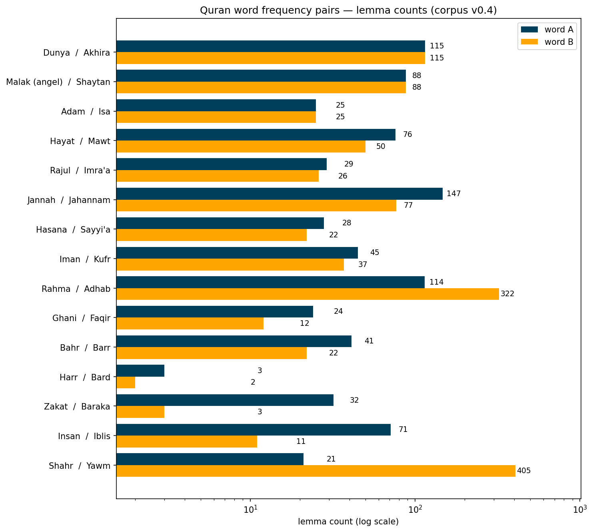

# Quran Word Frequency Counts

**A verified frequency count of 38 selected words in the Quran** (life, death, angel, satan,
this-world, hereafter, …), derived from the Quranic Arabic Corpus morphological annotation,
v0.4 [1]. Every word is counted by several uniform methods side by side — by lemma, by root, by
part of speech, by grammatical number — rather than by a single cherry-picked figure. The
results are validated three independent ways: against the raw annotation file, against the
corpus maintainers' current revision [2], and token-by-token against the canonical Uthmani text
[3] through the JQuranTree API [4]. All 3,960 counted occurrences are indexed by
chapter:verse:word so that any number in this document can be checked by hand.

*Counts computed and audited 2026-06-11 from corpus morphology v0.4 (frozen snapshot, committed
in `data/`). An earlier iteration of this project published several incorrect figures; the audit
that found and fixed them is documented in [Findings](#2-audit-findings-and-corrections) and
reproduced in `notebooks/03_audit_and_full_recount.ipynb`.*

---

## 1. Results

Lemma counts — the word in all its grammatical forms (singular, dual, plural, all cases).
Other counting methods are defined in [Methods](#3-methods) and reported for every word in
[`output/full_counts.csv`](output/full_counts.csv).

| Pair | A | B | Worth knowing |
|---|--:|--:|---|
| Dunya / Akhira | **115** | **115** | exact match; Akhira = feminine "hereafter" only (§2.2) |
| Malak / Shaytan | **88** | **88** | exact match; both lemmas include their plurals |
| Adam / Isa | **25** | **25** | exact match |
| Hayat / Mawt | 76 | 50 | with variant nouns: 79 / 56 (§2.4) |
| Rajul / Imra'a | 29 | 26 | with (suppletive) plurals: 57 / 85 |
| Jannah / Jahannam | 147 | 77 | Jannah includes جنات (71 plural) |
| Hasana / Sayyi'a | 28 | 22 | with -āt plurals: 31 / 58 |
| Iman / Kufr | 45 | 37 | Kufr with variant nouns: 41 |
| Rahma / Adhab | 114 | 322 | Rahma = number of surahs |
| Ghani / Faqir | 24 | 12 | exact 2:1 |
| Bahr / Barr | 41 | 22 | Barr = land 12 + righteous/dutiful 10 (§2.3) |
| Harr / Bard | 3 | 2 | with variants: 4 / 4 |
| Zakat / Baraka | 32 | 3 | Baraka with "blessed" (mubārak): 15 |
| Insan / Iblis | 71 | 11 | Insan + ins (collective): 89 |
| Shahr / Yawm | 21 | 405 | singular-only: **12** / **375** |

Standalone words: **Qaala** (said) 1,618 verb occurrences — 1,004 perfect, 265 imperfect, 349
imperative, of which *qul* ("say!", 2nd masculine singular) is 332. Embryology sequence:
turab (dust) 17 → nutfa (drop) 12 → alaqa (clot) 6 → mudgha (lump) 3 → izam (bones) 15 →
lahm (flesh) 12.

Two results that contradict popular claims, stated plainly:

- **Yawm (day) singular is 375, not 365.** The widely circulated "365 days" figure does not
  hold at the lemma level in this corpus (405 total = 375 singular + 27 plural + 3 dual);
  yawma'idhin ("that day", 68×) is a separate lemma and is not part of the 405.
- **Shahr (month) singular is 12**, which does match the popular claim.



(Variant of this chart as a table: [`output/pairs_table.png`](output/pairs_table.png). Both
regenerate from notebook 03.)

## 2. Audit findings and corrections

A from-scratch audit (2026-06-11) found that earlier published figures from this project
contained errors. Each finding below is shown with full supporting evidence in notebook 03,
section 2, and was confirmed against the corpus website [2].

### 2.1 Izam (bones): 2 → 15

The corpus tags the plural عظام (ʿiẓām, "bones") under the lemma `EaZiym` — the same lemma as
عظيم "great/mighty" — distinguishable only as noun entries with plural marking (`POS:N` + `MP`),
13 occurrences including the embryology verse 23:14 (twice). Counting the bone lemma `EaZom`
alone gives 2 and silently misses all of them. The corpus website keeps the same filing and
glosses those entries "[the bones]" (e.g. 2:259:51, 23:14:10, 75:3:5), so this is an upstream
annotation decision, not a parsing artifact; any bones count must use the selector
`(lemma=EaZiym, POS=N, NUMBER=P)`.

### 2.2 Akhira: masculine remainder is 40, not 30

Lemma `A^xir` totals 155 (not 145 as previously claimed): 115 feminine آخرة "the hereafter"
+ 40 masculine آخِر "last/latter" — two genuinely different words sharing one lemma, separated
by a gender filter. The separate lemma `A^xar` (آخَر "another", 70×) is not involved.

### 2.3 Barr: land 12 + righteous/dutiful 10 (was "13 + 9")

Form-level split of the 22 occurrences of lemma `bar~`: genitive `bar~i` ×12, all in "in the
land" contexts; 52:28 is the divine name *al-Barr*; 19:14 and 19:32 are "dutiful (to parents)";
أبرار ×6 and بررة ×1 are "the righteous". Every row is listed in notebook 03 §2.3.

### 2.4 Hayat/Mawt variant asymmetry

Mawt had been credited the variant nouns `mawotat` (3) + `mamaAt` (3) → 56 while Hayat received
nothing. Its exact counterparts — `m~aHoyaA` (2; 6:162 pairs مَحْيَا with مَمَات in a single
verse) and `HayawaAn` (1; 29:64 "the true life") — are now included symmetrically → 79.

### 2.5 Word count

The task list contains 38 words; earlier documentation said 37.

## 3. Methods

### 3.1 Counting unit

The corpus represents each word of the Quran as one or more *segments* (prefix, stem, suffix).
We count **STEM segments only** (77,915 in total): the definite article, attached pronouns, and
case endings are not words. The full annotation format and the Buckwalter transliteration used
throughout are described in the [Appendix](#appendix-corpus-format-and-transliteration).

### 3.2 Linguistic definitions

- **Lemma** (`LEM`) — the dictionary headword. The corpus files regular plurals, duals, and many
  broken plurals under the singular's lemma (e.g. أيام "days" under `yawom`), so a lemma count
  is "the word in all its grammatical forms".
- **Root** (`ROOT`) — the (usually three-consonant) derivational skeleton shared by related
  words (k-t-b → kitāb "book", kātib "writer", maktaba "library"). Proper nouns generally have
  no root in the corpus.
- **Broken / suppletive plurals** — irregular plurals stored under their *own* lemma
  (rajul "man" → rijāl "men"; imraʾa "woman" → nisāʾ "women", a different root entirely). These
  are standard Arabic morphology and are handled as explicit variants, listed per word.
- **PGN** — person-gender-number tags (e.g. `3MS`, `MP`); the trailing S/D/P gives grammatical
  number, with unmarked number read as singular (Arabic leaves singular implicit).

### 3.3 Counting methods

Applied uniformly to every word — no cherry-picking:

| Method | What it counts |
|---|---|
| **Lemma** | Exact lemma match, all grammatical forms |
| **Lemma + variants** | Plus declared variant selectors (irregular plurals / variant nouns under other lemmas) |
| **Singular only** | Lemma match, excluding dual and plural |
| **Root, nominal** | All nouns, adjectives, proper nouns, time adverbs sharing the root |
| **Root, by POS** | Root totals split by noun / adjective / proper noun / verb / time adverb |
| **By number** | Lemma split into singular / dual / plural |

A variant selector is either a plain lemma (`rijaAl` for `rajul`) or a `(lemma, POS, NUMBER)`
triple where only a slice of another lemma belongs to the word — required exactly once, for the
bones plural (§2.1). One gender filter exists (Akhira, §2.2); no other word needs one (verified
against all candidate lemmas).

All methods, plus per-root listings of every derived lemma and the Qaala verb-form breakdown,
are computed in notebook 03 and exported to `output/full_counts.csv`.

### 3.4 Tooling

The annotation file is a documented TSV; it is parsed directly with pandas (`src/parser.py`),
which is standard practice for this dataset. Alternatives were evaluated: JQuranTree [4] (Java;
used here for validation, not counting), QuranTree.jl [5] (Julia), and the `qurancorpus` pip
package [6] (abandoned; reads only the obsolete v0.1 XML format). The parser is verified line
by line against the raw file and by the validation layers below.

## 4. Validation

Three independent layers, strongest last:

1. **Internal.** The parser's STEM count is asserted against an independent scan of the raw
   file (77,915). Sixteen sanity asserts pin the audited values in notebook 03; the
   occurrence index is asserted to tie out with the count grid for all 38 words. The unit and
   integration test suite (`tests/`, 21 tests) pins the same invariants for CI-style checking.
2. **Upstream revision.** Every root used by the 38 words (35 roots) was compared against the
   corpus maintainers' dictionary pages [2] — every root total and every per-lemma count
   matched exactly (~140 numbers). Notebook 03 §9 records the comparison.
3. **Canonical text.** All 3,960 counted occurrences were verified against the Tanzil Uthmani
   text [3] via JQuranTree [4]: for each chapter:verse:word location, the token reconstructed
   from the morphology file (prefixes + stem + suffixes) was compared, letter for letter, with
   the token at that location in the canonical text. Result: **3,960/3,960 match, 0 mismatches,
   0 missing** (`validation/token_validation_report.txt`; scripts in `validation/`).

To verify any single number yourself: filter [`output/occurrences.csv`](output/occurrences.csv)
to the word — every counted occurrence is listed with its location, surface form, lemma, POS,
and number — and look the locations up in any Quran text or at corpus.quran.com.

## 5. Limitations and interpretive notes

- **Counts inherit the corpus's annotation decisions.** Where those decisions are surprising
  (bones under `EaZiym`, the Akhira lemma conflation, niswa under `nisaA^'`), this project
  documents and works around them explicitly rather than silently (§2; notebook 03).
- **Lemma counts include plurals and duals** unless the singular-only column is used; words
  differ in how much of their count is plural (e.g. 83% of malak's 88 is ملائكة).
- **Semantic splits are form-based, not interpretive.** The Barr land/righteous split (§2.3)
  follows surface form and morphology, with every row shown; no occurrence was classified by
  theological judgment.
- **v0.4 is a frozen snapshot** (2011). The corpus website continues to receive corrections;
  as of 2026-06-11 every compared number agreed, but future revisions could diverge.
- Word selection (the 38 words and the 15 pairings) follows the task specification
  (`TASK.txt`), not a linguistic criterion.

## 6. Prior and related work

- **The classical counting tradition.** Word counts of the Quran long predate computers; the
  standard reference is ʿAbd al-Bāqī's concordance [9], compiled by hand, which underlies most
  published figures. This project is the same exercise done against a machine-readable,
  morphologically tagged text, where every methodological choice is explicit and re-runnable.
- **Popular "numerical balance" claims.** The word-pair genre (dunya/akhira, angels/devils,
  life/death appearing equally often) was popularized by Nawfal [10] and circulates widely.
  Some of those claims reproduce exactly at the lemma level here (115/115, 88/88, 25/25);
  others do not under *any* method in the grid (life/death is 76–79 vs 50–56, not 145/145;
  yawm singular is 375, not 365). This project neither set out to confirm nor refute the
  genre — it reports what a tagged corpus yields under uniform rules.
- **Computational resources.** The Quranic Arabic Corpus and its annotation methodology
  [1, 8] are the foundation; Tanzil [3] provides the underlying verified text; JQuranTree [4],
  QuranTree.jl [5], and python-qurancorpus [6] are the existing programmatic interfaces.
  QuranMorph [11] is a recent independently produced morphological annotation of the Quran.
- **Earlier iteration of this repository.** Notebooks 01/02 predate the audit; their published
  figures contained the errors documented in §2 and have been corrected in place.

## 7. Future work

- **Full-vocabulary release** — extend the grid from the 38 selected words to every lemma and
  root in the corpus, as a citable frequency table.
- **Claims audit** — a systematic table of popular numerical claims, each evaluated against
  every counting method, so that "holds / holds only under method X / does not hold" is
  explicit per claim.
- **Cross-resource comparison** — quantify divergences between corpus v0.4, the website's
  current revision, QuranMorph [11], and ʿAbd al-Bāqī [9]; annotation differences like the
  bones case (§2.1) suggest more such cases exist outside our 38 words.
- **Semantic disambiguation** — the Barr land/righteous split (§2.3) is form-based; a
  context- or tafsir-informed classification of polysemous lemmas would let counts be reported
  per sense rather than per form.
- **Continuous verification** — run the test suite and token-level validation automatically on
  every change (CI), so the pinned numbers cannot drift silently.

## 8. Reproducing

Requires Python 3.12+ and [uv](https://docs.astral.sh/uv/). The data file is committed (license
permits verbatim copies — see [Data](#9-data-and-licensing)), so a fresh clone is self-contained:

```bash
git clone <this-repo> && cd quran-frequencies
uv sync
uv run jupyter notebook        # run the notebooks
uv run --extra dev pytest      # run the test suite (21 tests)
```

| Path | Contents |
|---|---|
| `notebooks/01_explore_and_discover.ipynb` | Lemma discovery per word, validation against sample verses, the four-method count |
| `notebooks/02_results_and_exploration.ipynb` | Pair tables, embryology sequence, open-ended exploration |
| `notebooks/03_audit_and_full_recount.ipynb` | **Authoritative**: audit evidence, full method grid, root listings, Qaala breakdown, validation record, chart generation |
| `output/full_counts.csv` | The complete method grid, one row per word |
| `output/occurrences.csv` | Every counted occurrence with chapter:verse:word location |
| `output/pairs_bars.png`, `output/pairs_table.png` | Charts (regenerated by notebook 03) |
| `src/parser.py`, `src/buckwalter.py` | Morphology TSV parser; Buckwalter ↔ Arabic conversion |
| `tests/` | Unit tests (16-line verbatim fixture) + integration tests (pinned audited counts) |
| `validation/` | Token-level validation scripts (Python + Java) and report |

Everything in `output/` regenerates by running notebook 03 top to bottom. The token validation
is re-run with the commands in the docstring of `validation/validate_locations.py`.

## 9. Data and licensing

The single data source is the **Quranic Arabic Corpus morphology file, v0.4** [1]
(`data/quranic-corpus-morphology-0.4.txt`, 77,915 STEM entries among 128,219 segment records),
which annotates every word of the Quran with part of speech, lemma, root, person/gender/number,
case, mood, and more, in Buckwalter transliteration [7], on top of the Tanzil Uthmani text [3].

The unmodified file is committed verbatim, as its terms permit (annotations: © 2011 Kais Dukes,
GNU GPL; text: © Tanzil.info, CC BY-ND 3.0 — both require the copyright block, which is intact
in the file, and attribution with links, given here and in [References](#references)). Do not
edit the file; updates come from the corpus download page [1].

Code in this repository (parser, notebooks, tests, validation scripts) is the author's own.

## References

1. Dukes, K. (2011). *Quranic Arabic Corpus: morphology annotation, version 0.4.* University of
   Leeds. https://corpus.quran.com — download: https://corpus.quran.com/download/
2. *Quranic Arabic Corpus — Quran Dictionary* (current revision; root pages, e.g.
   https://corpus.quran.com/qurandictionary.jsp?q=mlk). Accessed 2026-06-11.
3. Tanzil Project (2009). *Tanzil Quran Text (Uthmani, version 1.0.2).* http://tanzil.net
4. Dukes, K. *JQuranTree: Java API for the Quranic Arabic Corpus.*
   https://corpus.quran.com/java/ — source: https://github.com/dsog/jqurantree
5. Asaad, A.-A. (2021). "QuranTree.jl: A Julia Package for Quranic Arabic Corpus." *Proceedings
   of the Sixth Arabic Natural Language Processing Workshop (WANLP 2021).*
   https://aclanthology.org/2021.wanlp-1.22/
6. Chelli, A. *python-qurancorpus.* https://github.com/assem-ch/python-qurancorpus
7. Buckwalter, T. (2002). *Buckwalter Arabic Morphological Analyzer, version 1.0.* Linguistic
   Data Consortium. Transliteration scheme overview:
   https://en.wikipedia.org/wiki/Buckwalter_transliteration
8. Dukes, K., & Habash, N. (2010). "Morphological Annotation of Quranic Arabic." *Proceedings
   of LREC 2010.* — the paper describing the corpus annotation methodology.
9. ʿAbd al-Bāqī, M. F. (1945). *al-Muʿjam al-Mufahras li-Alfāẓ al-Qurʾān al-Karīm* (Concordance
   of the Words of the Noble Quran). Cairo. — the standard hand-compiled concordance.
10. Nawfal, ʿA. al-R. *al-Iʿjāz al-ʿAdadī lil-Qurʾān al-Karīm* (The Numerical Miracle of the
    Quran). — the work that popularized the word-pair balance claims.
11. Akra, D., Hammouda, T., & Jarrar, M. (2025). "QuranMorph: Morphologically Annotated Quranic
    Corpus." arXiv:2506.18148. https://arxiv.org/abs/2506.18148

## Appendix: corpus format and transliteration

Each line of the morphology file is a tab-separated record; a word may span several segments:

```
LOCATION    FORM    TAG    FEATURES
(1:1:1:1)   bi      P      PREFIX|bi+
(1:1:1:2)   somi    N      STEM|POS:N|LEM:{som|ROOT:smw|M|GEN
(1:1:2:1)   {ll~ahi PN     STEM|POS:PN|LEM:{ll~ah|ROOT:Alh|GEN
```

- **LOCATION** — `(chapter:verse:word:segment)`
- **FORM** — surface form in Buckwalter transliteration
- **FEATURES** — pipe-separated tags: segment type (`STEM`/`PREFIX`/`SUFFIX`), `POS:`, `LEM:`,
  `ROOT:`, aspect (`PERF`/`IMPF`/`IMPV`), voice, verb form (`(II)`…`(XII)`), case, state,
  person-gender-number flags, `MOOD:`, etc. `src/parser.py` maps these to typed columns.

Buckwalter transliteration is a one-ASCII-character-per-letter encoding of Arabic [7]. The
consonant map (vowels/diacritics omitted here; full map in `src/buckwalter.py`):

| BW | Arabic | | BW | Arabic | | BW | Arabic | | BW | Arabic |
|----|----|----|----|----|----|----|----|----|----|----|
| A | ا | | x | خ | | T | ط | | l | ل |
| b | ب | | d | د | | Z | ظ | | m | م |
| t | ت | | * | ذ | | E | ع | | n | ن |
| v | ث | | r | ر | | g | غ | | h | ه |
| j | ج | | z | ز | | f | ف | | w | و |
| H | ح | | s | س | | q | ق | | y | ي |
| $ | ش | | S | ص | | D | ض | | k | ك |

Corpus-specific extensions: `^` maddah, `` ` `` dagger alif, `{` alif wasla, `p` tāʾ marbūṭa,
`Y` alif maqṣūra, hamza seats `' > < & }`.
